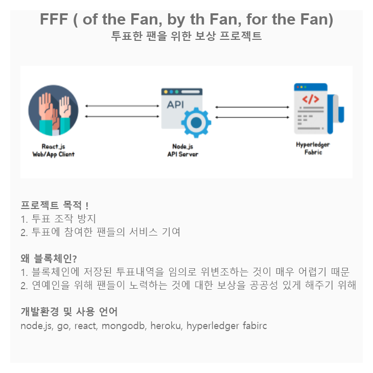
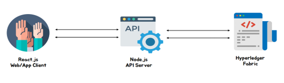

# 하이퍼레저 패브릭 기반 투표 앱 for 팬(Make for fan)

  

# 프로젝트 명
### 블록체인 기반 투표 앱 for 팬
  

# 프로젝트 팀
### 박찬형(팀장) | 김명석 | 원소희 | 최한솔
  

# 프로젝트 기간
### 19.11.26 ~ ing
  

# 프로젝트 목표(개요)
최근 서바이벌 오디션 프로그램이 폭발적인 인기를 끌었습니다.  
시청자는 국민 프로듀서가 되어 자신이 좋아하는 연습생에게 표를 행사하고 투표한 결과에 따라 연습생들이 그룹을 이루어 데뷔하게 되는데,  
이렇게 데뷔한 그룹들은 차세대 `K-POP` 인기의 주역이 되었습니다.
 

하지만, 얼마 전 `100%` `국민 프로듀서`의 투표로만 데뷔 멤버가 정해진다는 방송국 측의 말과 달리 내부자가 투표에 관여해 결과를 조작했다는 사실이 발각되었습니다.  
이에 따라 해당 오디션 프로그램으로 데뷔하게 된 연습생들이 더이상 방송 활동을 하지 못하게 조치가 취해졌고 있고,  
분노한 시청자들은 제작진에게 책임을 묻고 있습니다.
 

이러한 문제를 보면서,  
저희는 팬들에게 `Hyperledger Fabric`을 이용해 투명한 `K-POP` 투표 시스템을 제공하고자 합니다.  
내부자의 조작이 불가능한 모델로,  
투표에 참여하는 기관들이 합의 하에 투표 데이터를 저장하도록 해 투표한 모든 사람이 투표 결과를 신뢰할 수 있도록 합니다.  
나아가 `K-POP` 팬들에게 혜택이 돌아가는 서비스를 제공합니다.  
  

# 개발 언어 환경 | 구성 환경

 

| BlockChain | API Server | Applicationc|
|:----------:|:----------:|:----------:|
|Hyperledger Fabric | Node.js | React.js |

<h4>

- `Hyperledger Fabric` 네트워크를 작성하고, 네트워크에 `Smart Contract(Chaincode)`를 설치하고 인스턴스화합니다.
- `Node.js` 서버는 `Fabric SDK`를 사용하여 `Hyperledger Fabric` 네트워크와 상호작용하고, `Web/App` 클라이언트용 `API`를 작성합니다.
- `React.js` 클라이언트는 `Node.js` 애플리케이션 `API`를 사용하여 네트워크와 상호작용합니다.
- 사용자는 `React.js` 웹/앱 인터페이스와 상호작용하여 투표하고, 현재 상태를 조회하기 위해 `World State`를 쿼리합니다.

</h4>
  
